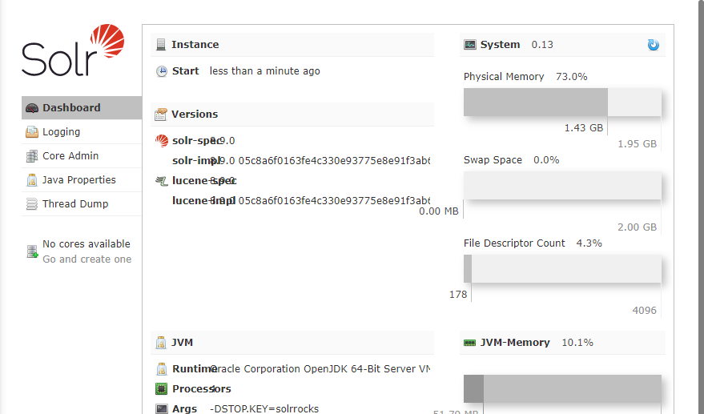
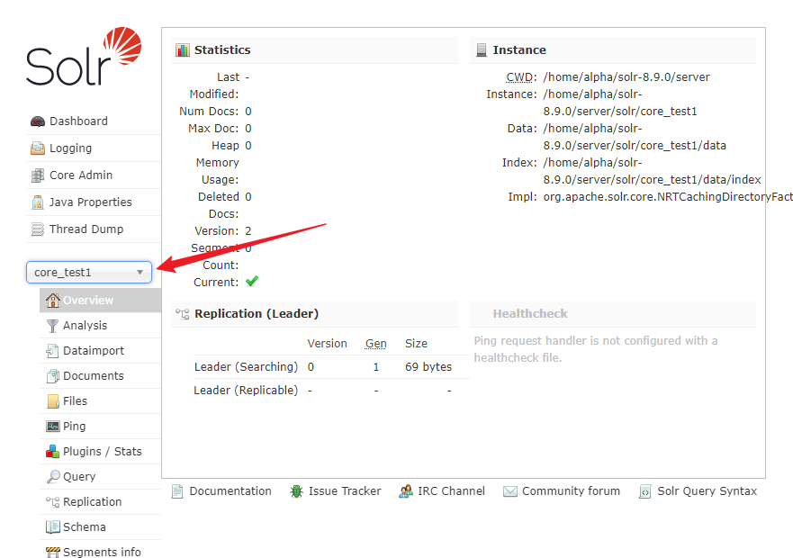
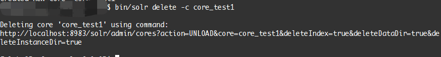
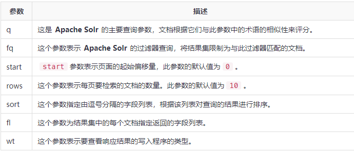

# solr备份

## solr安装

### 下载目录

```sh
https://archive.apache.org/dist/lucene/solr/8.9.0/
```

### 解压

```sh
tar -xvzf solr-8.9.0.tar.gz
```

## solr启动

### 简单启动

```sh
/bin/solr start 
```

默认的端口是8983, 启动后在浏览器访问可以看到相关配置



<br/>

## 添加core

```sh
bin/solr create -c core_test1
```

添加完成后在界面上选择创建的core就可以看到相应的信息



## 删除core

```sh
bin/solr delete -c core_test1 
```



<br/>

### solr 查询参数

