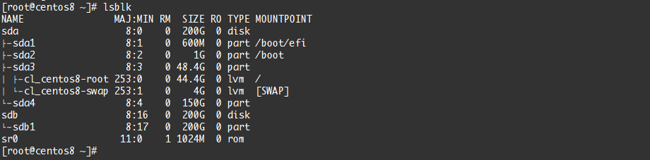

# 映射操作

## targetcli 

<br/>

### 目标端

#### 在target 上进行要分享设备的设置启动服务

```sh
systemctl start target
systemctl enable target （开启启动）
```

#### 添加一个设备

```sh
cd /backstores/fileio/create disk0 /tmp/disk0.img 10MBcd /backstores/ramdisk/create rd0 10MB
```

#### 创建target

```sh
 cd /iscsicd create （创建完之后portal自动创建）
```

#### 设置 ACL 

```sh
cd /iscsi/iqn.2003-01.org.linux-iscsi.localhost.x8664:sn.46377ffefd36/tpg1/acls/
create iqn.2003-01.org.linux-iscsi.localhost.x8664:sn.46377ffefd36
```

#### 设置TPG

```sh
0.0.0.0：3260
```

#### 开启端口

```sh
firewall-cmd --add-port 3260/tcp --permanent && firewall-cmd 
```

#### 添加（添加的设备）到tpg

```sh
cd /iscsi/iqn.2003-01.org.linux-iscsi.localhost.x8664:sn.46377ffefd36/tpg1/luns/
create /backstores/fileio/disk0create /backstores/ramdisk/rd0
```

#### 保存配置( **非常重要，不然重启后会配置会丢失**)

```sh
cd /
saveconfig
```

<br/>

### 发起端（initiator）

#### 查看自己的IQN

```sh
cat /etc/iscsi/initiatorname.iscsi
```

#### 添加发现

```sh
iscsiadm -m discovery -t sendtargets -p 192.168.50.145:3260
```

#### 登录

```sh
iscsiadm --mode node --targetname iqn.2003-01.org.linux-iscsi.localhost.x8664:sn.46377ffefd36 \
--portal 192.168.50.145 --login
```

#### 查看映射的设备

```sh
lsblk
```



<br/>

#### 格式化，挂载设备使用

#### 登出(任选一个)

```sh
iscsiadm --mode node --target <IQN> --portal x.x.x.x --logout
iscsiadm --mode node --logoutall=all
```

------


